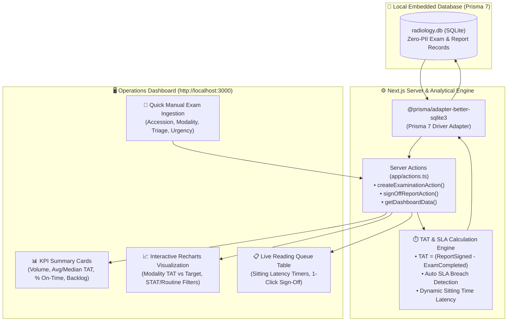

# 🏥 RADiTrack — Radiology Operations Intelligence & Turnaround Time (TAT) Analytics

> **Course:** CS 128.1 — Software Engineering / Health Informatics  
> **Institution:** University of the Philippines Manila  
> **Team:** Group O(n) point  
> **Privacy Specification:** **100% De-identified & Exam-Centric (Strict Zero-PII Policy)**  
> **Stack:** Next.js 16 (App Router) • React 19 • Prisma 7 ORM • SQLite (`radiology.db`) • Tailwind CSS v4 • shadcn/ui • Recharts v3 • TypeScript  

---

## ⚡ Quickstart Guide (Run Locally in 2 Minutes)

### 1. Prerequisites
Ensure your development environment has:
* **Node.js:** `v20.x` or `v22.x` (`node -v`)
* **npm:** `v10.x` or higher (`npm -v`)
* **Git**

---

### 2. Setup & Installation (Step-by-Step)

#### Step 1: Clone & Navigate into the Project Directory
```bash
# Clone the repository
git clone <repository-url>

# Navigate into the Next.js dashboard directory
cd raditrack-dashboard
```

#### Step 2: Configure Environment Variables (`.env`)
Copy `.env.example` to create your local `.env` file:
```bash
# Windows:
copy .env.example .env

# Mac / Linux:
cp .env.example .env
```
*(Ensure `DATABASE_URL="file:./radiology.db"` is set inside).*

#### Step 3: Install Dependencies
```bash
npm install
```

#### Step 4: Run Prisma 7 Database Migration
Creates `radiology.db` with all 6 tables, relations, and indexes:
```bash
npx prisma migrate dev --name init
```

#### Step 5: Generate Prisma 7 Client Types
```bash
npx prisma generate
```

#### Step 6: Seed Master Lookup Data
Pre-populates modalities, statuses, and SLA target benchmarks:
```bash
npx prisma db seed
```

#### Step 7: Launch the Next.js Server
```bash
npm run dev
```

Open your browser to:
👉 **`http://localhost:3000`**

---

## 📌 Project Overview

**RADiTrack** is a clinical operations intelligence platform designed to eliminate diagnostic delays in hospital radiology departments. It monitors the complete imaging workflow lifecycle, computes real-time **Turnaround Times (TAT)**, flags **Service Level Agreement (SLA)** breaches, and displays live interpretation queues and modality backlog metrics without handling patient personal demographic data.

### Core Extracted RIS Fields:
* **Accession Identifier:** Unique RIS examination code (`examination_identifier`)
* **Modality:** `CT`, `XRAY`, `MRI`, `US`, `MAMMO`
* **Workflow Timestamps:** Exam Completion ($T_1$) and Consultant Sign-off ($T_2$)
* **Turnaround Time (TAT):** $\text{TAT} = T_2 (\text{Report Signed}) - T_1 (\text{Exam Completed})$
* **Triage & Urgency:** `ER`, `OPD`, `IN` / `STAT`, `ROUTINE`

---

## 📂 Repository Structure

```
RADiTrack/
├── DIAGRAMS/                      # 📊 PlantUML diagrams & visual specifications
│   ├── System_Architecture_V1.puml
│   ├── Data_Flow.puml
│   └── ERD.puml
├── raditrack-dashboard/           # 💻 Next.js 16 Web Application & Database
│   ├── app/                       # App Router (pages & server actions)
│   ├── components/                # shadcn/ui & Recharts visualizations
│   ├── prisma/                    # Zero-PII Prisma 7 schema & seed script
│   ├── radiology.db               # SQLite database
│   └── .env.example               # Environment template
└── README.md                      # 📖 Project documentation & setup guide
```

---

## 🏗️ System Architecture & Zero-PII Data Flow



---

## 🧪 Live Dashboard Verification Walkthrough

Once running on `http://localhost:3000`, test the full end-to-end workflow:

1. **Log an Examination:**
   * Enter Accession: `ACC-2026-001`
   * Select Modality: `CT Scan`
   * Select Triage: `ER (Emergency)`
   * Select Urgency: `STAT (Emergency)`
   * Click **`Log Examination`**
   * *Observed Result:* `Total Volume` increments, `Reading Backlog` increments, and `ACC-2026-001` appears in the **Active Reading Queue** with a live sitting latency timer.

2. **Sign Off the Report:**
   * On the row for `ACC-2026-001`, click the green **`Mark Signed`** button.
   * *Observed Result:* TAT duration is calculated against the 60-minute ER STAT SLA target, the exam moves out of the reading queue, and `Average TAT` and `SLA Compliance %` cards update live!

3. **Interact with the Visualization:**
   * Toggle between `All Scans`, `STAT / ER`, and `Routine` buttons on the **Modality TAT Chart** to inspect dynamic performance bars and hover tooltips.

---

## 🗄️ Database Schema & Data Model (Zero-PII)

The database schema is 100% exam-centric and strictly adheres to hospital privacy standards:

| Model / Table | Role / Purpose | Key Fields |
| :--- | :--- | :--- |
| **`Modality`** (`modalities`) | Equipment catalog & maintenance state | `modalityCode` (PK), `modalityName`, `departmentRoom`, `isActive` |
| **`ExaminationStatus`** (`examination_statuses`) | Workflow progression milestones | `statusCode` (PK), `statusName`, `stageCategory`, `sequenceOrder` |
| **`Radiologist`** (`radiologists`) | Licensed physician directory | `radiologistId` (PK), `fullName`, `subspecialty`, `licenseNumber` |
| **`SlaConfiguration`** (`sla_configurations`) | TAT target rules by priority | `slaId` (PK), `modalityCode`, `triageLevel`, `urgencyLevel`, `targetTatMinutes` |
| **`Examination`** (`examinations`) | Core study entity (Zero-PII) | `examId` (PK), `examinationIdentifier` (Accession), `studyDate`, `examCompletedAt` ($T_1$) |
| **`RadiologyReport`** (`radiology_reports`) | Final signed report (1:1 with Exam) | `reportId` (PK), `reportSignedAt` ($T_2$), `tatExamToSignMinutes`, `isSlaBreached` |

---

## 🛠️ Helpful Commands

| Action | Command |
| :--- | :--- |
| **Start Dev Server** | `npm run dev` |
| **Format Prisma Schema** | `npx prisma format` |
| **Re-seed Database** | `npx prisma db seed` |
| **Reset Database from Scratch** | `npx prisma migrate reset` *(re-runs migrations & seed)* |
| **Inspect SQLite Visually** | Install VS Code extension **`SQLite Viewer`**, then click `radiology.db` |
| **Port Conflict Fallback** | `npm run dev -- -p 3001` |

---

## 👥 Project Team

* **Course:** CS 128.1 — Software Engineering / Health Informatics
* **Institution:** Department of Physical Sciences and Mathematics, College of Arts and Sciences, University of the Philippines Manila
* **Team:** Group O(n) point
